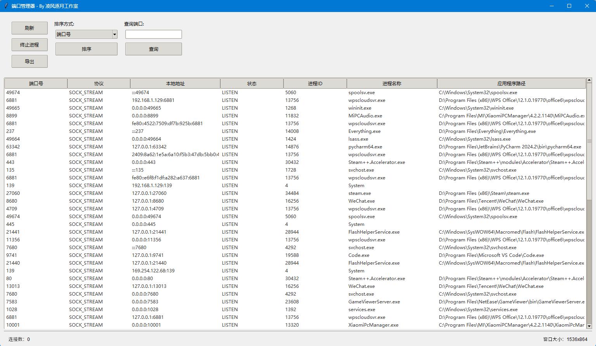

# 本地端口管理器

一个功能全面的本地端口管理工具，用于检测和管理本地端口占用情况。

## 主要功能

- 实时检测本地端口占用情况
- 显示端口对应的进程信息（进程ID、进程名称、应用程序路径）
- 支持按端口号、协议、本地地址等多列排序
- 快速查询指定端口
- 终止占用端口的进程
- 导出端口数据为CSV文件
- 友好的图形用户界面
- 优化的控制面板布局，功能分区清晰

## 控制面板布局优化

- 采用网格布局，界面更整洁
- 功能划分为三个独立面板：
  - 操作面板：刷新、终止进程、导出
  - 排序面板：多列排序选项
  - 搜索面板：端口查询
- 优化组件间距和对齐
- 增强布局灵活性
- 统一组件样式

## 安装说明

1. 确保已安装Python 3.8+
2. 克隆本仓库
3. 安装依赖：
   ```bash
   pip install -r requirements.txt
   ```

## 使用说明

### 命令行参数

```bash
python main.py [-h] [-l] [-g]
```

选项：
- `-h, --help`：显示帮助信息并退出
- `-l, --list`：列出所有端口占用情况
- `-g, --gui`：启动图形界面（默认）

### 示例用法

1. 列出所有端口占用情况：
   ```bash
   python main.py -l
   ```

2. 启动图形界面：
   ```bash
   python main.py -g
   ```

### 图形界面功能

1. 主界面功能：
   - 点击"刷新"按钮更新端口信息
   - 在查询框中输入端口号并点击"查询"按钮
   - 选择表格中的进程，点击"终止进程"按钮
   - 点击"导出"按钮保存当前端口数据
   - 使用排序功能对表格数据进行排序

## 截图示例（窗口程序）



## 贡献指南

欢迎提交issue和pull request。请确保：
1. 代码符合PEP8规范
2. 添加相应的单元测试
3. 更新CHANGELOG.md文件

## 许可证

MIT License
